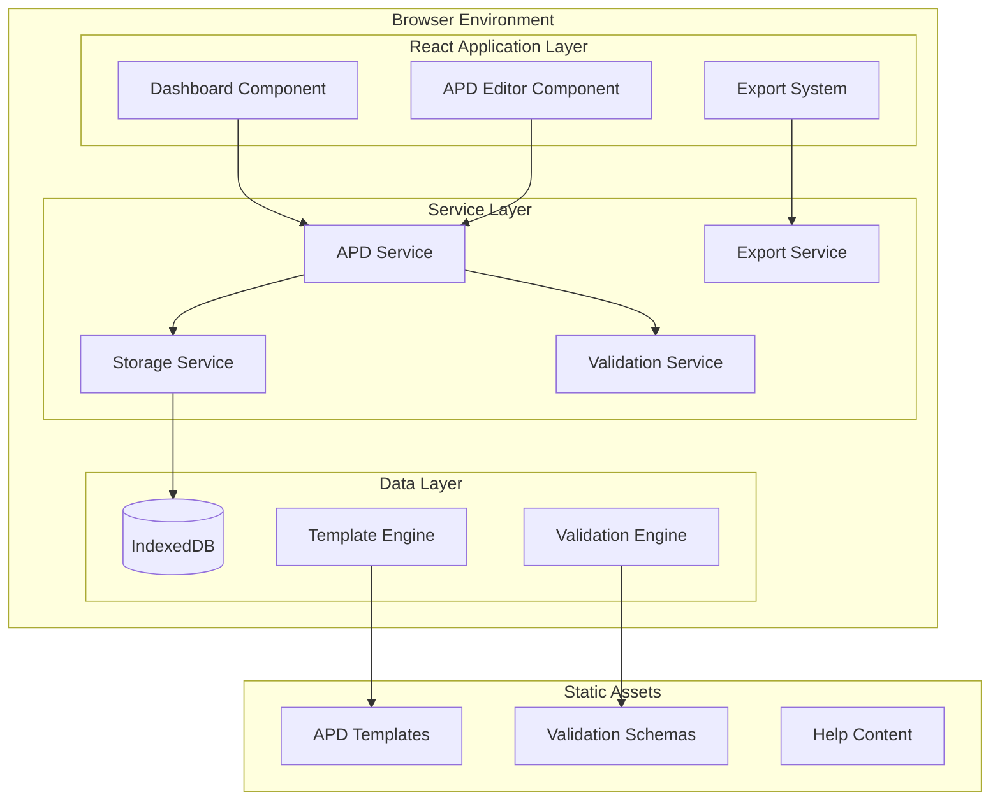
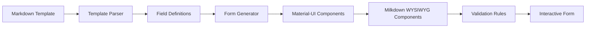
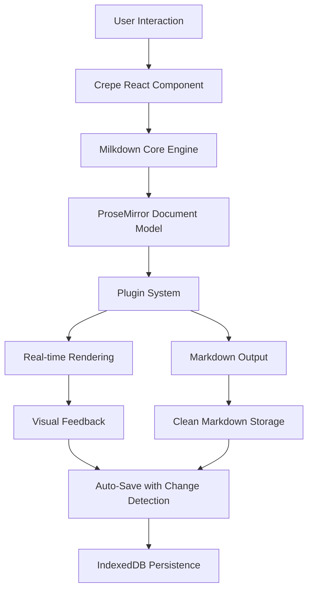
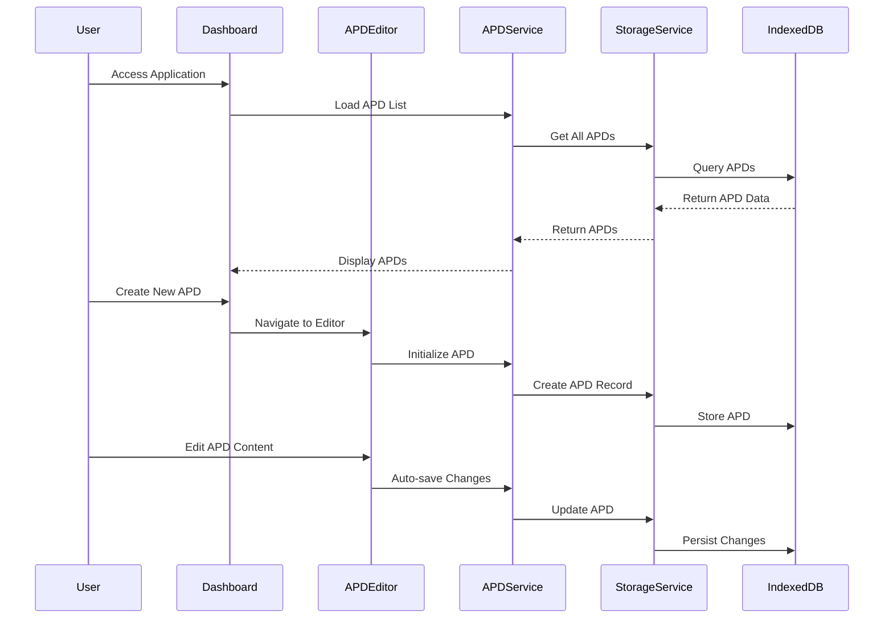

# Design Document

## Overview

The eAPD-Next Web Application is a modern, client-side React application built with Next.js and Material-UI that provides a comprehensive solution for creating, managing, and exporting APDs (Advance Planning Documents) for state Medicaid agencies. The application operates entirely within the browser using IndexedDB for local storage, ensuring complete data privacy and offline functionality.

The architecture follows a dashboard-centric approach where users manage multiple APDs from a central interface, then navigate to dedicated editors for creating and modifying APDs based on official CMS templates. The application emphasizes accessibility, developer learning, and integration with Kiro AI development tools.

### Key Design Principles for Learning Developers

This design prioritizes **learning and understanding** over complexity:

1. **Clear Separation of Concerns**: Each service has a single responsibility, making it easier to understand and test
2. **TypeScript-First**: Strong typing helps catch errors early and provides excellent IDE support
3. **Component Composition**: Small, reusable components that are easier to understand and maintain
4. **Explicit Dependencies**: Clear interfaces make it obvious what each component needs
5. **Progressive Enhancement**: Start with basic functionality and add features incrementally

### TurboTax-Like User Experience Design

The application mimics TurboTax's guided experience through:

- **Step-by-Step Navigation**: Linear progression through APD sections with clear "Next/Previous" buttons
- **Progress Visualization**: Visual progress bar showing completion percentage and remaining sections
- **Contextual Help**: Always-visible help text and examples for each field
- **Smart Defaults**: Pre-populated fields based on previous entries and common patterns
- **Validation Feedback**: Real-time validation with clear, actionable error messages
- **Save and Continue**: Ability to save progress and return later without losing work

## Architecture

### High-Level Architecture



### Template Integration System

The core innovation of eAPD-Next is automatically converting CMS markdown templates into interactive forms with Markdown-based text input:



**Template Processing Pipeline:**

1. **Parse Markdown**: Extract sections, fields, and help text from template files
2. **Generate Schema**: Create TypeScript interfaces and validation rules
3. **Build Forms**: Dynamically create Material-UI form components with WYSIWYG support
4. **Apply WYSIWYG**: Use Milkdown editors for text fields with visual formatting
5. **Apply Validation**: Real-time validation for content structure and completeness
6. **Calculate Budgets**: Automatic calculations for budget tables and totals

### Advanced WYSIWYG Text Editing with Milkdown and Crepe

The application uses Milkdown with Crepe (React integration) to provide a professional-grade WYSIWYG editing experience that stores content as clean Markdown:



**Milkdown Plugin Architecture Integration:**

- **Core Plugins**: `@milkdown/plugin-commonmark` for standard Markdown, `@milkdown/plugin-gfm` for GitHub Flavored Markdown
- **UI Enhancement Plugins**: `@milkdown/plugin-block` for drag-and-drop, `@milkdown/plugin-slash` for quick content insertion
- **Content Plugins**: `@milkdown/plugin-table` for visual table editing, `@milkdown/plugin-math` for budget calculations
- **Interaction Plugins**: `@milkdown/plugin-tooltip` for formatting toolbar, `@milkdown/plugin-clipboard` for smart paste
- **Advanced Plugins**: `@milkdown/plugin-diagram` for system architecture diagrams, `@milkdown/plugin-prism` for code highlighting

**Crepe React Integration Features:**

- **React Hooks**: `useEditor` for editor instance management, `useNodeViewFactory` for custom components
- **Component Integration**: Seamless integration with Material-UI form components and validation
- **State Management**: Proper React state synchronization with Milkdown document state
- **Event Handling**: React-friendly event handling for editor interactions and changes

**APD-Specific Customizations Leveraging Existing Infrastructure:**

```typescript
// APD-Specific Milkdown Configuration with Existing Tool Integration
interface APDMilkdownConfig {
  // Core plugins for standard editing (lazy loaded)
  corePlugins: [
    '@milkdown/plugin-commonmark',
    '@milkdown/plugin-gfm',
    '@milkdown/plugin-history',
  ];

  // UI enhancement plugins (conditionally loaded based on APD section)
  uiPlugins: [
    '@milkdown/plugin-block', // Drag-and-drop content blocks
    '@milkdown/plugin-slash', // Quick insertion menu with MUI Menu integration
    '@milkdown/plugin-tooltip', // Floating toolbar with MUI theme
    '@milkdown/plugin-cursor', // Enhanced cursor behavior
  ];

  // Content-specific plugins (lazy loaded per section needs)
  contentPlugins: [
    '@milkdown/plugin-table', // Visual table editing extending MUI Table patterns
    '@milkdown/plugin-math', // Math expressions integrated with existing calculation engine
    '@milkdown/plugin-diagram', // Mermaid diagrams for architecture sections
    '@milkdown/plugin-emoji', // Emoji support for user-friendly content
  ];

  // APD-specific custom plugins leveraging existing services
  customPlugins: [
    'apd-budget-table-plugin', // Extends existing BudgetCalculationEngine
    'apd-personnel-table-plugin', // Uses existing MUI Table and validation patterns
    'apd-section-navigation-plugin', // Integrates with existing ProgressTracker
    'apd-validation-plugin', // Extends existing ValidationService
  ];

  // Material-UI theme integration using established theme system
  theme: {
    primary: materialUITheme.palette.primary.main;
    secondary: materialUITheme.palette.secondary.main;
    background: materialUITheme.palette.background.paper;
    surface: materialUITheme.palette.background.default;
    // Leverage existing MUI spacing and typography
    spacing: materialUITheme.spacing;
    typography: materialUITheme.typography;
  };

  // Performance optimization using established patterns
  performance: {
    lazyLoadPlugins: true; // Use React.lazy patterns
    memoizeComponents: true; // Use React.memo patterns
    debounceAutoSave: 5000; // Use existing auto-save infrastructure
    maxRenderTime: 100; // Follow established 100ms render target
  };

  // Accessibility integration using existing standards
  accessibility: {
    ariaLabels: true; // Use established ARIA patterns
    keyboardNavigation: true; // Follow existing keyboard navigation
    screenReaderSupport: true; // Integrate with existing accessibility testing
    colorContrast: 'WCAG_AA'; // Use established color contrast standards
  };

  // Testing integration using established patterns
  testing: {
    reactTestingLibrary: true; // Use existing RTL patterns
    jestConfiguration: true; // Follow existing Jest setup
    accessibilityTesting: true; // Use @axe-core/react integration
    performanceTesting: true; // Add to existing performance benchmarks
  };
}

// Custom APD Content Types
interface APDContentTypes {
  budgetTable: {
    type: 'budget-table';
    attrs: {
      tableType: 'personnel' | 'contractor' | 'hardware' | 'software';
      ffpRate: 90 | 75 | 50;
      autoCalculate: boolean;
    };
  };

  personnelSection: {
    type: 'personnel-section';
    attrs: {
      roleType: 'state' | 'contractor';
      costCenter: string;
    };
  };

  regulatoryReference: {
    type: 'regulatory-reference';
    attrs: {
      regulation: string;
      section: string;
      url?: string;
    };
  };
}
```

**Advanced Features Implementation Leveraging Existing Infrastructure:**

- **Slash Commands**: Custom APD-specific slash commands using existing MUI Menu patterns for inserting budget tables, personnel sections, regulatory references
- **Block Manipulation**: Drag-and-drop using existing MUI interaction patterns for reorganizing APD sections, budget line items, and content blocks
- **Smart Tables**: Specialized table components extending existing MUI Table infrastructure with automatic calculations, validation, and APD-specific formatting
- **Content Templates**: Pre-built content blocks leveraging existing template parsing system for common APD sections (executive summary templates, budget table templates)
- **Collaborative Editing**: Foundation for future real-time collaboration using `@milkdown/plugin-collab` with existing version control infrastructure
- **Performance Integration**: Milkdown optimization using established React.memo, lazy loading, and 100ms render target patterns
- **Accessibility Integration**: Full WCAG compliance using existing @axe-core/react testing and established ARIA patterns
- **Error Handling**: Milkdown error boundaries using existing error handling patterns and MUI error display components
- **Testing Integration**: Comprehensive testing using established React Testing Library, Jest, and accessibility testing patterns
- **Bundle Optimization**: Tree-shaking and code splitting using established performance optimization and build processes

### Budget Calculation Engine

Addresses the #1 user pain point - complicated budget calculations:

```typescript
interface BudgetCalculationEngine {
  // Automatic calculation of federal/state shares
  calculateFederalShare(total: number, ffpRate: number): number;

  // Validation of budget consistency across sections
  validateBudgetConsistency(apd: APD): ValidationResult;

  // Real-time calculation updates as user types
  updateCalculations(fieldId: string, value: number): void;

  // Generate budget summary tables
  generateBudgetSummary(apd: APD): BudgetSummary;
}
```

### Component Architecture

The application follows a hierarchical component structure optimized for Material-UI and React best practices:

**📁 File Organization Strategy for Learning:**

- Each component lives in its own folder with index.ts, Component.tsx, Component.test.tsx, and README.md
- README.md explains the component's purpose, props, and usage examples
- Tests serve as living documentation of expected behavior

```
src/
├── components/
│   ├── common/
│   │   ├── Layout/
│   │   ├── Navigation/
│   │   ├── ErrorBoundary/
│   │   └── LoadingSpinner/
│   ├── dashboard/
│   │   ├── APDList/
│   │   ├── APDCard/
│   │   ├── ProjectGroup/
│   │   └── CreateAPDDialog/
│   ├── apd-editor/
│   │   ├── APDEditor/
│   │   ├── SectionNavigation/
│   │   ├── ProgressTracker/
│   │   └── sections/
│   │       ├── ExecutiveSummary/
│   │       ├── ProjectManagement/
│   │       ├── StatementOfNeeds/
│   │       └── BudgetTables/
│   ├── forms/
│   │   ├── FormField/
│   │   ├── WYSIWYGEditor/
│   │   ├── ValidationMessage/
│   │   ├── BudgetTable/
│   │   └── DatePicker/
│   └── export/
│       ├── ExportDialog/
│       ├── FormatSelector/
│       └── ProgressIndicator/
├── services/
│   ├── apdService.ts
│   ├── storageService.ts
│   ├── exportService.ts
│   ├── validationService.ts
│   └── templateService.ts
├── types/
│   ├── apd.ts
│   ├── template.ts
│   └── validation.ts
├── hooks/
│   ├── useAPD.ts
│   ├── useAutoSave.ts
│   ├── useValidation.ts
│   └── useExport.ts
├── utils/
│   ├── templateParser.ts
│   ├── validationRules.ts
│   └── exportHelpers.ts
├── templates/
│   ├── papd-template.json
│   ├── iapd-template.json
│   ├── oapd-template.json
│   └── parsers/
│       ├── markdownParser.ts
│       ├── fieldExtractor.ts
│       └── validationGenerator.ts
├── kiro/
│   ├── steering/
│   │   ├── development-standards.md
│   │   ├── apd-domain-knowledge.md
│   │   ├── material-ui-guidelines.md
│   │   └── git-workflow.md
│   └── hooks/
│       ├── pre-commit.js
│       ├── test-runner.js
│       └── documentation-updater.js
└── docs/
    ├── LEARNING_PATH.md
    ├── ARCHITECTURE_DECISIONS.md
    ├── COMPONENT_GUIDE.md
    └── TROUBLESHOOTING.md
```

### Data Flow Architecture



## Components and Interfaces

### Core Components

#### Dashboard Component

```typescript
interface DashboardProps {
  onCreateAPD: (type: APDType) => void;
  onOpenAPD: (apdId: string) => void;
}

interface APDListItem {
  id: string;
  type: APDType;
  projectName: string;
  lastModified: Date;
  completionStatus: number; // 0-100
  isComplete: boolean;
}
```

#### APD Editor Component

```typescript
interface APDEditorProps {
  apdId: string;
  onSave: (apd: APD) => Promise<void>;
  onNavigateBack: () => void;
}

interface APDSection {
  id: string;
  title: string;
  isRequired: boolean;
  isComplete: boolean;
  validationErrors: ValidationError[];
  component: React.ComponentType<APDSectionProps>;
}
```

#### Form Components with Milkdown Integration

```typescript
interface FormFieldProps {
  name: string;
  label: string;
  type:
    | 'text'
    | 'milkdown-editor'
    | 'number'
    | 'date'
    | 'select'
    | 'textarea'
    | 'budget-table'
    | 'personnel-table';
  required?: boolean;
  helpText?: string;
  validation?: ValidationRule[];
  value: any;
  onChange: (value: any) => void;
  milkdownOptions?: MilkdownEditorOptions;
}

interface MilkdownEditorProps {
  value: string; // Markdown content
  onChange: (markdownValue: string) => void;
  placeholder?: string;
  helpText?: string;
  maxLength?: number;
  validationErrors?: ValidationError[];
  editorOptions: MilkdownEditorOptions;
  apdContext?: APDContext; // Context for APD-specific features
}

interface MilkdownEditorOptions {
  // Core plugin configuration
  enableCommonmark: boolean;
  enableGFM: boolean;
  enableMath: boolean;
  enableDiagram: boolean;

  // UI enhancement plugins
  enableBlockPlugin: boolean; // Drag-and-drop blocks
  enableSlashPlugin: boolean; // Quick insertion menu
  enableTooltipPlugin: boolean; // Floating toolbar
  enableClipboardPlugin: boolean; // Smart paste

  // Content-specific plugins
  enableTablePlugin: boolean; // Visual table editing
  enableEmojiPlugin: boolean; // Emoji support
  enablePrismPlugin: boolean; // Code highlighting

  // APD-specific configurations
  apdContentTypes?: APDContentType[];
  customSlashCommands?: SlashCommand[];
  budgetTableConfig?: BudgetTableConfig;

  // Editor behavior
  maxLength?: number;
  autoSave?: boolean;
  autoSaveDelay?: number;

  // Material-UI theme integration
  theme?: MilkdownThemeConfig;
}

interface APDContext {
  apdType: 'PAPD' | 'IAPD' | 'OAPD';
  sectionId: string;
  fieldPath: string;
  projectName: string;
  availableFFPRates: number[];
}

interface SlashCommand {
  id: string;
  label: string;
  description: string;
  icon?: string;
  keywords: string[];
  handler: (editor: Editor) => void;
}

interface APDContentType {
  type: string;
  label: string;
  description: string;
  icon?: string;
  defaultAttrs?: Record<string, any>;
  nodeSpec: NodeSpec;
  component?: React.ComponentType<any>;
}

interface BudgetTableConfig {
  tableType: 'personnel' | 'contractor' | 'hardware' | 'software' | 'training';
  ffpRate: 90 | 75 | 50;
  autoCalculate: boolean;
  columns: BudgetColumn[];
  validationRules: BudgetValidationRule[];
}

interface MilkdownThemeConfig {
  primaryColor: string;
  secondaryColor: string;
  backgroundColor: string;
  surfaceColor: string;
  textColor: string;
  borderColor: string;
  focusColor: string;
  errorColor: string;
  warningColor: string;
  successColor: string;
}

interface BudgetTableProps {
  tableType: 'personnel' | 'contractor' | 'hardware' | 'software' | 'training';
  columns: BudgetColumn[];
  rows: BudgetRow[];
  calculations: CalculationRule[];
  ffpRate: 90 | 75 | 50;
  onCellChange: (rowId: string, columnId: string, value: number) => void;
  onRowAdd: () => void;
  onRowDelete: (rowId: string) => void;
  validationErrors?: BudgetValidationError[];
  milkdownIntegration?: boolean; // Whether this table is embedded in Milkdown
}

interface PersonnelTableProps extends BudgetTableProps {
  roleTypes: ('state' | 'contractor')[];
  costCenters: string[];
  onRoleChange: (rowId: string, role: 'state' | 'contractor') => void;
  onCostCenterChange: (rowId: string, costCenter: string) => void;
}
```

### Service Interfaces

#### APD Service

```typescript
interface APDService {
  createAPD(type: APDType, projectName: string): Promise<APD>;
  getAPD(id: string): Promise<APD | null>;
  updateAPD(apd: APD): Promise<void>;
  deleteAPD(id: string): Promise<void>;
  getAllAPDs(): Promise<APDListItem[]>;
  duplicateAPD(id: string): Promise<APD>;
  validateAPD(apd: APD): ValidationResult;
}
```

#### Version Control Service

```typescript
interface VersionControlService {
  // Working copy management
  getWorkingCopy(apdId: string): Promise<APDWorkingCopy>;
  updateWorkingCopy(apdId: string, changes: FieldChange[]): Promise<void>;

  // Commit operations
  commitChanges(
    apdId: string,
    message: string,
    author: string
  ): Promise<APDVersion>;
  getCommitHistory(apdId: string): Promise<APDVersion[]>;

  // Version operations
  getVersion(apdId: string, versionId: string): Promise<APDVersion>;
  revertToVersion(apdId: string, versionId: string): Promise<APDWorkingCopy>;

  // Change tracking
  getChanges(apdId: string): Promise<FieldChange[]>;
  compareVersions(
    apdId: string,
    fromVersion: string,
    toVersion: string
  ): Promise<VersionDiff>;

  // Branch-like operations
  createWorkingCopyFromVersion(
    apdId: string,
    versionId: string
  ): Promise<APDWorkingCopy>;
}
```

#### Change Tracking Service

```typescript
interface ChangeTrackingService {
  // Field-level change detection
  detectChanges(original: APD, modified: APD): FieldChange[];
  trackFieldChange(
    fieldPath: string,
    oldValue: any,
    newValue: any,
    timestamp: Date
  ): void;

  // Change highlighting
  getFieldChangeStatus(fieldPath: string): ChangeStatus;
  generateChangeHighlights(apd: APD): ChangeHighlight[];

  // Diff generation
  generateDiff(version1: APDVersion, version2: APDVersion): VersionDiff;
  generateInlineDiff(
    fieldPath: string,
    oldValue: any,
    newValue: any
  ): InlineDiff;
}
```

#### Storage Service

```typescript
interface StorageService {
  initialize(): Promise<void>;
  store(key: string, data: any): Promise<void>;
  retrieve(key: string): Promise<any>;
  delete(key: string): Promise<void>;
  list(prefix?: string): Promise<string[]>;
  backup(): Promise<Blob>;
  restore(data: Blob): Promise<void>;
}
```

#### Export Service

```typescript
interface ExportService {
  exportToMarkdown(apd: APD): Promise<string>;
  exportToPDF(apd: APD): Promise<Blob>;
  exportToJSON(apd: APD): Promise<string>;
  generateFileName(apd: APD, format: ExportFormat): string;
}
```

## Data Models

### APD Data Model with Version Control

```typescript
interface APD {
  id: string;
  type: APDType;
  metadata: APDMetadata;
  sections: Record<string, APDSectionData>;
  validationState: ValidationState;
  createdAt: Date;
  updatedAt: Date;

  // Version control
  currentVersion: string; // Points to latest committed version
  workingCopy?: APDWorkingCopy; // Current uncommitted changes
  versions: APDVersion[]; // All committed versions
}

interface APDWorkingCopy {
  id: string;
  apdId: string;
  baseVersionId: string; // Version this working copy was created from
  sections: Record<string, APDSectionData>;
  changes: FieldChange[]; // All uncommitted changes
  lastModified: Date;
  hasUncommittedChanges: boolean;
}

interface APDVersion {
  id: string; // Unique version identifier
  apdId: string;
  versionNumber: string; // v1.0, v1.1, v1.2, etc.
  commitMessage: string; // User-provided description of changes
  author: string; // Who made this commit
  timestamp: Date;
  sections: Record<string, APDSectionData>; // Full snapshot
  changesSinceLastVersion: FieldChange[]; // What changed from previous version
  parentVersionId?: string; // Previous version (for history chain)
}

interface FieldChange {
  id: string;
  fieldPath: string; // e.g., "sections.budget.personnel.row1.federalShare"
  fieldLabel: string; // Human-readable field name
  oldValue: any;
  newValue: any;
  changeType: 'added' | 'modified' | 'deleted';
  timestamp: Date;
  author?: string;
  section: string; // Which APD section this belongs to
}

interface VersionDiff {
  fromVersion: string;
  toVersion: string;
  changes: FieldChange[];
  summary: {
    sectionsModified: string[];
    fieldsAdded: number;
    fieldsModified: number;
    fieldsDeleted: number;
  };
}

interface ChangeHighlight {
  fieldPath: string;
  changeType: 'added' | 'modified' | 'deleted';
  displayType: 'inline' | 'background' | 'border';
  tooltip: string; // Description of what changed
}

type ChangeStatus = 'unchanged' | 'modified' | 'added' | 'deleted';

interface InlineDiff {
  fieldPath: string;
  oldText: string;
  newText: string;
  diffHtml: string; // HTML with change highlighting
}

interface APDMetadata {
  stateName: string;
  stateAgency: string;
  primaryContact: ContactInfo;
  submissionDate?: Date;
  documentType: 'PAPD' | 'IAPD' | 'OAPD' | 'AoA' | 'Acquisition Checklist';
  benefitsMultiplePrograms: boolean;
  projectName: string;
}

interface APDSectionData {
  sectionId: string;
  title: string;
  content: Record<string, any>;
  isComplete: boolean;
  lastModified: Date;
}
```

### Template Data Model

```typescript
interface APDTemplate {
  id: string;
  type: APDType;
  version: string;
  sections: TemplateSection[];
  validationRules: ValidationRule[];
}

interface TemplateSection {
  id: string;
  title: string;
  description: string;
  fields: TemplateField[];
  subsections?: TemplateSection[];
  isRequired: boolean;
  helpText?: string;
}

interface TemplateField {
  id: string;
  name: string;
  label: string;
  type: FieldType;
  required: boolean;
  validation?: ValidationRule[];
  helpText?: string;
  options?: SelectOption[];
  defaultValue?: any;
}
```

### Validation Data Model

```typescript
interface ValidationRule {
  type: 'required' | 'minLength' | 'maxLength' | 'pattern' | 'custom';
  value?: any;
  message: string;
  validator?: (value: any, context: any) => boolean;
}

interface ValidationResult {
  isValid: boolean;
  errors: ValidationError[];
  warnings: ValidationWarning[];
}

interface ValidationError {
  fieldId: string;
  sectionId: string;
  message: string;
  severity: 'error' | 'warning';
}
```

### Storage Schema with Version Control

```typescript
// IndexedDB Schema
interface APDDatabase {
  apds: {
    key: string; // APD ID
    value: APD;
    indexes: {
      type: APDType;
      projectName: string;
      lastModified: Date;
      currentVersion: string;
    };
  };

  apdVersions: {
    key: string; // Version ID
    value: APDVersion;
    indexes: {
      apdId: string;
      versionNumber: string;
      timestamp: Date;
      author: string;
    };
  };

  workingCopies: {
    key: string; // APD ID (one working copy per APD)
    value: APDWorkingCopy;
    indexes: {
      apdId: string;
      baseVersionId: string;
      lastModified: Date;
      hasUncommittedChanges: boolean;
    };
  };

  fieldChanges: {
    key: string; // Change ID
    value: FieldChange;
    indexes: {
      apdId: string;
      versionId: string;
      fieldPath: string;
      timestamp: Date;
      changeType: string;
    };
  };

  projects: {
    key: string; // Project ID
    value: {
      id: string;
      name: string;
      apdIds: string[];
      createdAt: Date;
    };
  };

  templates: {
    key: string; // Template ID
    value: APDTemplate;
  };

  settings: {
    key: string; // Setting key
    value: any;
  };
}
```

## Error Handling

### Error Boundary Strategy

```typescript
interface ErrorBoundaryState {
  hasError: boolean;
  error?: Error;
  errorInfo?: ErrorInfo;
}

// Global error handling for different error types
enum ErrorType {
  STORAGE_ERROR = 'STORAGE_ERROR',
  VALIDATION_ERROR = 'VALIDATION_ERROR',
  EXPORT_ERROR = 'EXPORT_ERROR',
  TEMPLATE_ERROR = 'TEMPLATE_ERROR',
  NETWORK_ERROR = 'NETWORK_ERROR',
}

interface AppError {
  type: ErrorType;
  message: string;
  details?: any;
  recoverable: boolean;
  userMessage: string;
}
```

### Recovery Mechanisms

- **Auto-save Recovery**: Restore unsaved changes from IndexedDB on application restart
- **Data Corruption Recovery**: Validate data integrity and provide repair options
- **Export Failure Recovery**: Retry mechanisms with progressive fallbacks
- **Storage Quota Recovery**: Data cleanup and compression options

## Testing Strategy

### Unit Testing

- **Component Testing**: React Testing Library for all UI components
- **Service Testing**: Jest for business logic and data services
- **Hook Testing**: Custom hooks with React Hooks Testing Library
- **Utility Testing**: Pure function testing for validation and export utilities

### Integration Testing

- **User Flow Testing**: Complete APD creation and editing workflows
- **Storage Integration**: IndexedDB operations and data persistence
- **Export Integration**: End-to-end export functionality testing
- **Template Integration**: Template parsing and form generation

### Accessibility Testing

- **Automated Testing**: axe-core integration for WCAG compliance
- **Screen Reader Testing**: NVDA and JAWS compatibility
- **Keyboard Navigation**: Tab order and keyboard-only operation
- **Color Contrast**: Automated contrast ratio validation

### Performance Testing

- **Load Time Testing**: Bundle size analysis and loading performance
- **Memory Usage**: IndexedDB storage efficiency and memory leaks
- **Rendering Performance**: Large form and table rendering optimization
- **Export Performance**: Large document generation benchmarks

## Security Considerations

### Data Privacy

- **Local-Only Storage**: No data transmission to external servers
- **Encryption**: Optional client-side encryption for sensitive data
- **Data Isolation**: Separate storage per browser profile
- **Secure Deletion**: Proper data cleanup on APD deletion

### Input Validation

- **XSS Prevention**: Sanitization of all user inputs
- **Data Validation**: Schema validation for all stored data
- **File Upload Security**: Validation of imported JSON files
- **Template Security**: Validation of template definitions

### Browser Security

- **Content Security Policy**: Strict CSP headers
- **Secure Contexts**: HTTPS-only operation
- **Storage Limits**: Graceful handling of storage quota limits
- **Cross-Origin Protection**: Proper CORS configuration for assets

## Performance Optimization

### Bundle Optimization

- **Code Splitting**: Route-based and component-based splitting
- **Tree Shaking**: Elimination of unused Material-UI components
- **Lazy Loading**: Dynamic imports for large components
- **Asset Optimization**: Image and font optimization

### Runtime Performance

- **Virtual Scrolling**: For large APD lists and tables
- **Memoization**: React.memo and useMemo for expensive operations
- **Debounced Auto-save**: Optimized save frequency
- **IndexedDB Optimization**: Efficient queries and indexing

### Memory Management

- **Component Cleanup**: Proper useEffect cleanup
- **Event Listener Management**: Automatic cleanup on unmount
- **Large Data Handling**: Streaming for large exports
- **Cache Management**: LRU cache for frequently accessed data

## Deployment Architecture

### Simple Production Deployment

```yaml
# GitHub Actions Workflow Structure
production:
  branch: main
  url: https://username.github.io/eapd-next/
  trigger: automatic on push to main

development:
  branches: feature/* (local development only)
  testing: npm run dev (local development server)
  deployment: merge to main when ready
```

### Build Process

1. **Dependency Installation**: npm ci for reproducible builds
2. **Type Checking**: TypeScript compilation and type validation
3. **Testing**: Unit and integration test execution
4. **Linting**: ESLint and Prettier validation
5. **Building**: Next.js static export generation
6. **Optimization**: Asset optimization and compression
7. **Deployment**: GitHub Pages deployment with proper routing

### Progressive Web App Configuration

```typescript
// PWA Manifest
interface PWAManifest {
  name: 'eAPD-Next';
  short_name: 'eAPD-Next';
  description: 'APD Creation and Management Tool';
  start_url: '/';
  display: 'standalone';
  background_color: '#ffffff';
  theme_color: '#1976d2';
  icons: PWAIcon[];
}

// Service Worker Strategy
interface ServiceWorkerConfig {
  cacheStrategy: 'CacheFirst' | 'NetworkFirst' | 'StaleWhileRevalidate';
  cacheName: string;
  precacheAssets: string[];
  runtimeCaching: CacheRule[];
}
```

## Learning Developer Support & Kiro Integration

### Documentation Strategy for Learning

**📚 Learning-First Documentation Structure:**

1. **README.md** - Start here guide with:
   - Quick start instructions (5 minutes to running app)
   - Architecture overview with diagrams
   - "How to add a new feature" walkthrough
   - Links to all other documentation

2. **LEARNING_PATH.md** - Structured learning progression:
   - Week 1: Understanding React and TypeScript basics
   - Week 2: Material-UI component patterns
   - Week 3: State management and data flow
   - Week 4: Testing strategies and implementation
   - Week 5: Advanced patterns and optimization

3. **ARCHITECTURE_DECISIONS.md** - Explains "why" not just "what":
   - Why IndexedDB over localStorage?
   - Why Material-UI over other libraries?
   - Why this component structure?
   - Trade-offs and alternatives considered

4. **COMPONENT_GUIDE.md** - Component patterns and examples:
   - How to create a new form component
   - Material-UI best practices
   - Accessibility patterns
   - Testing patterns for each component type

### Kiro Steering Documents Configuration

**📋 .kiro/steering/ Directory Structure:**

```markdown
# development-standards.md

- TypeScript strict mode requirements
- ESLint and Prettier configuration
- Component naming conventions
- File organization patterns
- Code review checklist

# apd-domain-knowledge.md

- APD types and their purposes
- CMS regulatory requirements
- Budget calculation rules
- Template structure explanations
- User workflow patterns

# material-ui-guidelines.md

- Preferred MUI components for each use case
- Theme customization patterns
- Accessibility implementation with MUI
- Performance considerations
- Common MUI patterns and anti-patterns

# git-workflow.md

- Branch naming conventions
- Commit message standards
- Pull request templates
- Release process
- Simple deployment procedures
```

### Kiro Agent Hooks Implementation

**🔧 Automated Development Assistance:**

```javascript
// .kiro/hooks/pre-commit.js
// Runs before each commit to ensure code quality
module.exports = {
  tasks: [
    'npm run type-check',
    'npm run lint',
    'npm run test:changed',
    'npm run accessibility-check',
  ],
  onFailure: 'provide-fix-suggestions',
};

// .kiro/hooks/test-runner.js
// Automatically runs relevant tests when files change
module.exports = {
  watchPatterns: ['src/**/*.ts', 'src/**/*.tsx'],
  testCommand: 'npm run test:watch',
  coverageThreshold: 90,
};

// .kiro/hooks/documentation-updater.js
// Updates documentation when code changes
module.exports = {
  triggers: ['component-added', 'interface-changed'],
  actions: ['update-component-guide', 'regenerate-api-docs'],
};
```

### Step-by-Step Implementation Guides

**🛠️ Implementation Roadmap for Learning Developers:**

#### Phase 1: Foundation (Week 1-2)

1. **Project Setup**
   - Initialize Next.js with TypeScript
   - Configure Material-UI theme
   - Set up ESLint, Prettier, and testing
   - Create basic folder structure

2. **Basic Dashboard**
   - Create layout component with MUI AppBar
   - Implement APD list with MUI DataGrid
   - Add create APD button with MUI Dialog
   - Set up routing between dashboard and editor

#### Phase 2: Core Features (Week 3-4)

1. **Template System**
   - Parse markdown templates into JSON schemas
   - Generate form components from schemas
   - Implement field validation
   - Add help text integration

2. **Data Management**
   - Set up IndexedDB with Dexie.js
   - Implement auto-save functionality
   - Create data backup/restore features
   - Add offline detection

#### Phase 3: Advanced Features (Week 5-6)

1. **Export System**
   - PDF generation with jsPDF
   - Markdown export with proper formatting
   - JSON export for data sharing
   - Progress indicators for large exports

2. **Polish & Optimization**
   - Performance optimization
   - Accessibility improvements
   - Error boundary implementation
   - PWA configuration

### Code Examples and Patterns

**🎯 Learning-Focused Code Examples:**

```typescript
// Example: How to create a new form component
// File: src/components/forms/FormField/FormField.tsx

/**
 * FormField Component
 *
 * Purpose: Renders different types of form fields based on template definitions
 *
 * Learning Notes:
 * - Uses Material-UI components for consistent styling
 * - Implements proper TypeScript typing for props
 * - Includes accessibility attributes (ARIA labels)
 * - Handles validation state and error messages
 *
 * Usage Example:
 * <FormField
 *   field={templateField}
 *   value={currentValue}
 *   onChange={handleChange}
 *   error={validationError}
 * />
 */

interface FormFieldProps {
  field: TemplateField; // What type of field to render
  value: any; // Current field value
  onChange: (value: any) => void; // Callback when value changes
  error?: ValidationError; // Optional validation error
}

export const FormField: React.FC<FormFieldProps> = ({
  field,
  value,
  onChange,
  error,
}) => {
  // Implementation with detailed comments explaining each part...
};
```

### Troubleshooting Guide for Common Issues

**🔍 Common Developer Challenges:**

1. **TypeScript Errors**
   - "Property does not exist on type" → Check interface definitions
   - "Cannot find module" → Verify import paths and file extensions

2. **Material-UI Issues**
   - Theme not applying → Check ThemeProvider wrapper
   - Components not responsive → Review breakpoint usage

3. **IndexedDB Problems**
   - Data not persisting → Check browser storage limits
   - Queries failing → Verify index configuration

4. **Testing Challenges**
   - Components not rendering → Check test setup and mocks
   - Async operations failing → Use proper async/await patterns

This design provides a comprehensive foundation for implementing the eAPD-Next application with proper separation of concerns, scalable architecture, and robust error handling while maintaining focus on accessibility, performance, and developer learning experience. The integration with Kiro tools ensures that AI assistance is maximized throughout the development process.
